<a href="https://mittal-shashwat.vercel.app">
  
</a>

&nbsp;

#### `[ID]`

```ts
const shashwat = {
  role:     'Software Engineer · SDE-II',
  team:     '@upstox',
  city:     'Mumbai, India',
  shipping: 'Scalper Terminal · 10M+ users',
  driving:  'AI-tooling adoption · engineering-efficiency',
} as const;
```

&nbsp;

#### `[NOW]`

```bash
$ ls -la ./current-focus

drwxr-xr-x  scalper-terminal/        # ms-level HFT trading platform
drwxr-xr-x  tv-platform-ui-lib/      # internal lib · multi-product
drwxr-xr-x  ai-tooling-rollout/      # team-wide eng-efficiency
```

&nbsp;

#### `[STACK]`

```ts
type Stack = {
  primary:        'TypeScript' | 'React' | 'Next.js' | 'Redux';
  comfortable:    'C++' | 'Python' | 'Java' | 'Node';
  shipping_with:  'Tailwind' | 'SCSS' | 'AWS' | 'Mixpanel' | 'Coralogix';
  exploring:      'low-latency-systems' | 'design-systems' | 'ai-eng';
};
```

&nbsp;

#### `[LOG]`

```bash
$ git log --author='shashwat' --oneline -8

7f3c2a1  perf(option-chain): cut re-renders, +70% real-time perf
9bd821e  feat(plus): responsive landing, drove +30% conversion
4ae5219  perf(app): drop memory footprint −30% (−70% in hot paths)
e1f8c40  feat(scalper): ship ms-level HFT terminal to prod
2c5d3b8  refactor(orders): consolidate endpoints behind unified API
8f7a193  feat(strategy): multi-leg options builder
d4c9e7a  feat(tv-platform): co-author internal UI library
0b9e4f2  feat(cdsl): migrate auth flow · 10M+ users on web/mobile
```

&nbsp;

#### `[REACH]`

`linkedin`&nbsp;&nbsp;→&nbsp;&nbsp;[mittal-shashwat](https://linkedin.com/in/mittal-shashwat)  
`portfolio`&nbsp;&nbsp;→&nbsp;&nbsp;[mittal-shashwat.vercel.app](https://mittal-shashwat.vercel.app)  
`github`&nbsp;&nbsp;&nbsp;&nbsp;→&nbsp;&nbsp;[shashwat-mittal](https://github.com/shashwat-mittal)  
`email`&nbsp;&nbsp;&nbsp;&nbsp;&nbsp;→&nbsp;&nbsp;[shashwat6479@gmail.com](mailto:shashwat6479@gmail.com)
